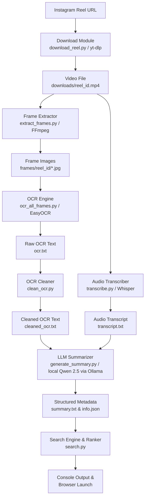

# Media Knowledge Retrieval Engine

> Turn short-form media into a searchable personal knowledge base using OCR, speech recognition, and LLMs.

---

## 1. Project Title & Subtitle
**Media Knowledge Retrieval Engine**  
*Turn short-form media into a searchable personal knowledge base using OCR, speech recognition, and LLMs.*

---

## 2. Project Overview
In the era of rapid content consumption, platforms like Instagram, TikTok, and YouTube Shorts serve as hubs for high-value tutorials, code snippets, recipes, and productivity tips. However, searching and retrieving this content later is incredibly difficult because:
*   **Lack of Text Indexing:** Platforms only index titles, hashtags, or basic descriptions, leaving the actual audio transcript and visual content unsearched.
*   **Black Box Collections:** Saved folders are represented as a chronological grid of video thumbnails. Users are forced to manually scroll and re-watch videos to find specific information.

The **Media Knowledge Retrieval Engine** solves this by downloading saved videos, transcribing their audio, performing Optical Character Recognition (OCR) on visual frames, and leveraging a local LLM (Qwen 2.5:3b) to synthesize a highly structured summary and searchable keywords. This transforms fleeting video streams into an offline, fully searchable personal knowledge base.

---

## 3. Motivation
It is a common habit to save reels containing interesting hacks, coding tips, or recipe instructions, only to let them disappear into the void of "Saved" folders, never to be found again. Existing Instagram collections and bookmark tools fall short because:
1. **Audio and Video are Silent to Search:** A voiceover explaining a specific terminal command or a screen displaying a line of code is completely invisible to search queries.
2. **Platform Dependency & Decay:** Saved bookmarks can disappear if a creator deletes the video or the platform changes its API.
3. **No Automatic Organization:** Sorting hundreds of bookmarked links manually is tedious and rarely maintained.

**Our Solution** creates an automated ingest pipeline. Instead of leaving saved media as raw links, we extract their multi-modal content (audio speech and visual text overlays), run local intelligence to generate structured metadata, and host a lightweight search and indexing system that lets you launch the original source in your browser instantly.

---

## 4. Features

### 📦 Media Processing
*   **Automated Downloader:** Fetches high-quality video files (`.mp4`) locally from Instagram Reel URLs using `yt-dlp`.
*   **Frame Extraction:** Uses `FFmpeg` to sample video frames at regular intervals (1 frame every 2 seconds) to capture screen shifts, text cards, and slide presentations.
*   **Visual Text Extraction (OCR):** Scans extracted frame images using `EasyOCR` to detect, extract, and index text shown on screen.
*   **Speech-to-Text (Transcription):** Transcribes the video's audio using OpenAI's `Whisper` ("small" model) and automatically translates spoken foreign language content into English.

### 🧠 AI Synthesis
*   **Cross-Referencing Engine:** Fuses noisy OCR data and transcribed speech, prioritizing visual text when audio is low-quality, and audio transcripts when visual text is sparse.
*   **Local LLM Summarization:** Uses a locally run `Qwen 2.5 (3B)` model via Ollama to generate structured summaries, key takeaways, and name entities (tools, technologies, people, brands).
*   **Smart Keyword Extraction:** Generates 8-15 highly relevant search keywords including synonyms, beginner-friendly terms, and advanced search phrases.
*   **Auto-Collection Assignment:** Organizes the video content into collections (e.g., Productivity, Cooking, Technology, Lifestyle) for structured indexing.

### 🔍 Search & Retrieval
*   **Weighted Scoring Index:** Ranks search results by matching queries against multiple metadata fields using distinct relevance weights.
*   **Console Presentation:** Displays matches sorted by relevance scores showing the Topic, Summary, and "Why Save" sections in a clean console format.
*   **Instant Source Launch:** Allows launching the original Instagram reel in the default web browser directly from search console prompts.

---

## 5. Architecture
The following diagram demonstrates the high-level processing pipeline from the input URL to the searchable local repository.



---

## 6. Folder Structure
Below is the layout of the project workspace and the purpose of each file and folder:

```
media-knowledge-retrieval/
│
├── downloads/            # Local storage for downloaded raw .mp4 videos.
├── frames/               # Extracted JPEG frames for each video, grouped by Reel ID.
├── metadata/             # Directory containing generated text indexes and structured metadata.
│   └── [reel_id]/        # Subfolder holding files for a specific processed Reel.
│       ├── info.json     # Basic download metadata (Reel URL, ID, timestamp).
│       ├── ocr.txt       # Raw text strings captured by the OCR engine.
│       ├── cleaned_ocr.txt # Refined OCR text after filtering out noise and duplicates.
│       ├── transcript.txt # Whisper-generated speech-to-text transcript.
│       └── summary.txt   # Local LLM summary detailing Topic, Takeaways, Keywords, and Collections.
│
├── .agent/               # Agent workflow files, rules, and workspace configurations.
├── run_pipeline.py       # Main entry point to run the ingestion pipeline for a single Reel.
├── process_all.py        # Batch ingestion script to process all videos in the downloads/ folder.
├── pipeline_utils.py     # Shared library functions containing the core pipeline logic.
├── download_reel.py      # Download helper utilizing yt-dlp.
├── extract_frames.py     # Standalone frame extraction script utilizing FFmpeg.
├── transcribe.py         # Standalone audio transcription script using Whisper.
├── ocr_all_frames.py     # Standalone EasyOCR execution script.
├── clean_ocr.py          # Standalone OCR text sanitizer script.
├── generate_summary.py   # Standalone summarization script utilizing local Ollama.
├── search.py             # CLI application for searching, ranking, and launching Reels.
├── ocr_test.py           # Verification script for EasyOCR installation.
└── pyscript.py           # Quick download script for testing yt-dlp options.
```

---

## 7. Metadata Structure
For every processed Reel, the engine outputs files to `metadata/[reel_id]/`:

### `info.json`
Stores the original reference details of the download session:
```json
{
    "id": "DYPFRgoTeC3",
    "source": "instagram",
    "type": "reel",
    "url": "https://www.instagram.com/reel/DYPFRgoTeC3/",
    "downloaded_at": "2026-07-31T21:10:00.000000"
}
```

### `transcript.txt`
Contains the raw English translation of the audio track.
*Example:* `"Here is how you can set up a local Docker container for database testing in under three minutes..."`

### `ocr.txt`
A sorted list of unique raw strings detected across video frames.
*Example:*
```
DOCKER RUN
POSTGRES
docker-compose.yml
localhost:5432
```

### `cleaned_ocr.txt`
Filters out OCR noise (such as timestamps, emojis, or short fragments) and duplicate entries.
*Rules applied:*
1. Minimum length of 3 characters.
2. Must contain at least one alphabetic letter (`[A-Za-z]`).
3. Case-insensitive deduplication.

### `summary.txt`
The output of the local LLM structured using system prompts. It uses the following sections:
*   **Topic:** The specific recipe name, product, technology, or course (e.g., *Docker Database Container Setup*).
*   **Summary:** High-level narrative description of the reel's content.
*   **Key Takeaways:** Bulleted list of actionable learnings or configuration commands.
*   **Important Names:** Extracted tools, technologies, and products (e.g., *Docker, Postgres, WSL2*).
*   **Why Save:** The concrete utility of saving this reel (e.g., *Quick setup guide for database development environments*).
*   **Assigned Collection:** Main theme folder categorization (e.g., *Technology*).
*   **Search Keywords:** A list of 8 to 15 searchable phrases for the indexer.

---

## 8. Pipeline Explanation
The execution pipeline operates through six distinct steps:

1.  **Download:** The user inputs an Instagram Reel URL. `download_reel.py` runs a subprocess calling `yt_dlp` to fetch the stream and write the video file to `downloads/{reel_id}.mp4`.
2.  **Frame Extraction:** `extract_frames` launches `FFmpeg` to parse the video. By setting `-vf fps=1/2`, we extract 1 frame every 2 seconds. The frames are saved to `frames/{reel_id}/frame_%03d.jpg`.
3.  **Transcription:** `transcribe_video` loads Whisper's `small` model. It transcribes the audio, translates non-English languages to English (`task="translate"`), and writes the transcript to `metadata/{reel_id}/transcript.txt`. The model is immediately deleted from memory, and garbage collection (`gc.collect()`) is run to optimize system RAM.
4.  **OCR Extraction:** `run_ocr` initializes the EasyOCR reader. It iterates through all JPEGs in the frames folder, extracts text, strips surrounding whitespace, and writes unique occurrences into `metadata/{reel_id}/ocr.txt`.
5.  **OCR Cleaning:** `clean_ocr` runs to remove noisy lines from `ocr.txt`. It filters out short snippets (<3 characters), lines with no letters (such as purely numerical overlays), and case-insensitive duplicates, saving the output to `metadata/{reel_id}/cleaned_ocr.txt`.
6.  **Summarization:** `generate_summary` reads `transcript.txt` and `cleaned_ocr.txt` and feeds them into a custom LLM prompt. Ollama invokes `qwen2.5:3b`, which cross-references the transcript and OCR to resolve transcription or optical errors, generating a structured report saved at `metadata/{reel_id}/summary.txt`.

---

## 9. Search & Scoring System
The search tool (`search.py`) compiles a local database from the files in the `metadata/` directory.

### How Search and Scoring Works
1.  **Loading Index:** The engine scans directories under `metadata/`, reads the `info.json` and `summary.txt` files, and extracts structured sections (Topic, Summary Section, Why Save, Keywords) using string parsers.
2.  **Matching Queries:** When a query is inputted, it is split into lowercase keywords. The algorithm matches these keywords against the extracted metadata.
3.  **Accumulating Score:** For each query word, a reel gets score increments calculated using custom multipliers:

| Search Target | Match Location | Score Multiplier |
| :--- | :--- | :--- |
| **Topic** | Title, Product, or Tech Name | **10x** |
| **Keywords** | AI-generated Search Keywords | **5x** |
| **Summary** | Full `summary.txt` document | **1x** |

### Rationale Behind Field Weights
*   **Why Topic is weighted 10x (High Weight):** The topic represents the primary focal point of the video (e.g., "WSL2 installation"). If a user searches "WSL2", matching the topic field indicates a strong probability that the reel is specifically about WSL2, making it the most important search signal.
*   **Why Keywords is weighted 5x (Medium Weight):** The AI extracts synonyms, product alternatives, and technical names under `Search Keywords`. While these are highly descriptive terms, they do not necessarily define the main topic, representing a medium-strength signal.
*   **Why Summary is weighted 1x (Low Weight):** The full summary contains conversational text, general explanations, and connective filler. Matching a search word here is a weaker indicator of relevancy and could represent a false positive (e.g., mentioning "Docker" in passing while discussing WSL2).

### Retrieval and Browser Launch
The matching results are sorted in descending order of their total score. Users are presented with a numbered list in the CLI terminal. Selecting a number triggers Python's native `webbrowser` module, launching the original Instagram Reel URL directly in the user's default browser.

---

## 10. Tech Stack
*   **Programming Language:** Python 3.10+
*   **Downloader:** `yt-dlp` (Advanced video wrapper)
*   **Video Processing:** `FFmpeg` (Video frame demuxer)
*   **OCR Engine:** `EasyOCR` (Backed by PyTorch & OpenCV)
*   **Speech Recognition:** `OpenAI Whisper` (Local speech-to-text decoder)
*   **Local LLM Host:** `Ollama` (Local model runner)
*   **LLM Model:** `Qwen2.5:3b` (Lightweight, instruction-following local language model)
*   **Standard Python Libraries:** `re`, `subprocess`, `json`, `pathlib`, `gc`, `webbrowser`

---

## 11. AI Models Used
*   **Whisper ("small"):** Provides high-accuracy transcription for conversational English speech and robust translations for non-English audio files. The "small" variant is ideal for fast execution on standard CPU/GPU resources.
*   **EasyOCR:** A lightweight, highly portable optical character recognition library that performs well on graphical, stylized caption cards commonly used in short-form video overlays.
*   **Qwen 2.5 (3B):** Run locally through Ollama. Qwen 2.5:3b provides strong performance in structured output compliance, multilingual reasoning, and document summarizing while fitting into standard consumer-grade GPU configurations.

---

## 12. Data Flow
The visual representation below details the transformation and storage of data across the pipeline:

```
Instagram Reel URL
       │
       ▼ [download_reel.py]
downloads/[reel_id].mp4
       │
       ├─► [FFmpeg] ──► frames/[reel_id]/frame_001.jpg, frame_002.jpg ...
       │                                  │
       │                                  ▼ [EasyOCR]
       │                              metadata/[reel_id]/ocr.txt
       │                                  │
       │                                  ▼ [clean_ocr.py]
       │                              metadata/[reel_id]/cleaned_ocr.txt
       │
       └─► [Whisper] ─────────────────► metadata/[reel_id]/transcript.txt
                                                 │
                                                 ▼ [generate_summary.py]
                                        metadata/[reel_id]/summary.txt
                                                 │
                                                 ▼ [search.py]
                                      Terminal search and browser launcher
```

---

## 13. Installation

### 📋 Prerequisites
1.  **Python 3.10+** installed on your system.
2.  **FFmpeg** installed and added to your system's environment `PATH` variables.
    *   *Windows:* Install via `winget install Gyan.FFmpeg` or download from the official FFmpeg website.
    *   *macOS:* Install via Homebrew: `brew install ffmpeg`
    *   *Linux:* Install via package manager: `sudo apt install ffmpeg`
3.  **Ollama** installed on your system.
    *   Once Ollama is installed, run the model pull command in your terminal:
        ```bash
        ollama pull qwen2.5:3b
        ```

### ⚙️ Setup Instructions
1.  **Clone the Repository:**
    ```bash
    git clone <repository_url>
    cd version1_insta
    ```
2.  **Configure Virtual Environment:**
    ```bash
    python -m venv .venv
    
    # Activate on Windows:
    .venv\Scripts\activate
    
    # Activate on macOS/Linux:
    source .venv/bin/activate
    ```
3.  **Install Python Dependencies:**
    Install dependencies using pip:
    ```bash
    pip install yt-dlp easyocr openai-whisper torch torchvision torchaudio
    ```

---

## 14. Running the Project

### Processing a New Instagram Reel
To download and ingest a new Reel into your local database:
```bash
python run_pipeline.py
```
1.  Paste the target Reel URL when prompted (e.g., `https://www.instagram.com/reel/DYPFRgoTeC3/`).
2.  The script downloads the media, extracts visual frames, runs Whisper transcription, EasyOCR extraction, cleans the data, and outputs the summary.

### Batch Processing Pre-downloaded Videos
If you manually placed several `.mp4` video files inside the `downloads/` folder, run the batch pipeline script:
```bash
python process_all.py
```
This runs the full processing pipeline over every video inside the directory.

### Searching and Retrieving Media
To query your knowledge base and view results:
```bash
python search.py
```
1.  Enter your search terms when prompted (e.g., `docker compose` or `css grid`).
2.  The engine will list sorted results matching your query with relevance scores.
3.  Type the result index number (e.g., `1`) to open the original Instagram Reel source in your default browser.
